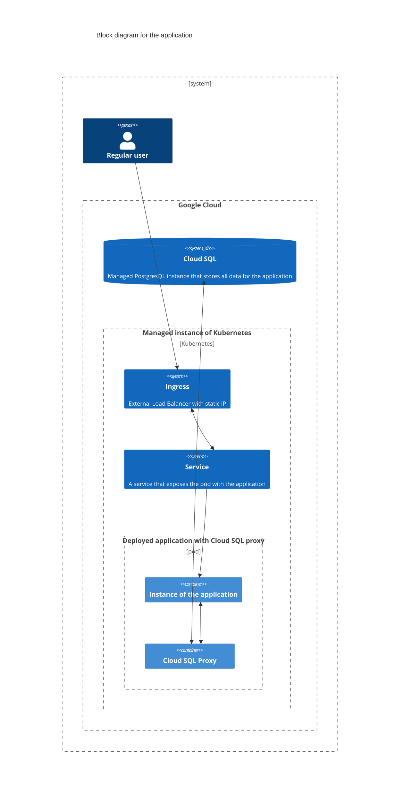
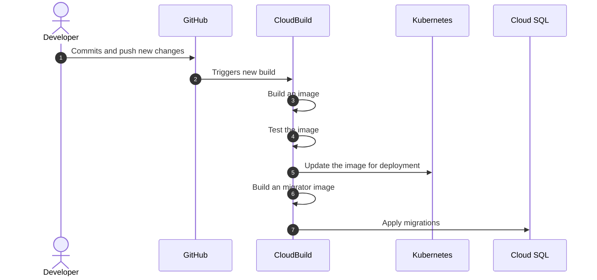
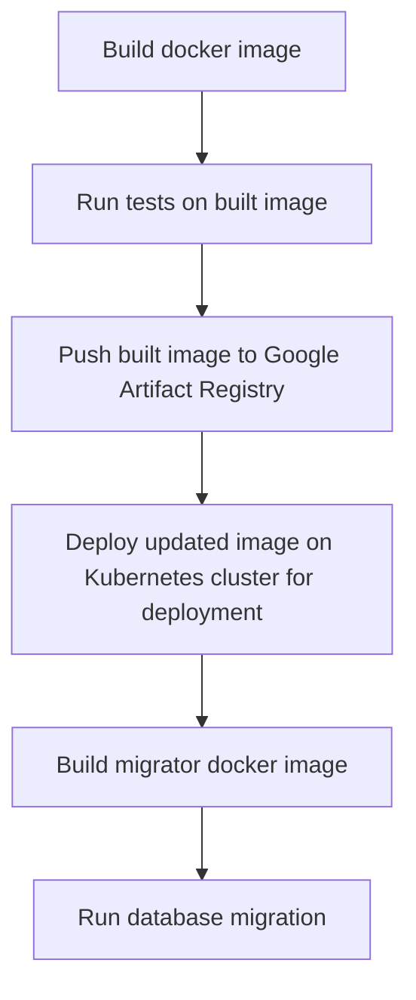

```shell
EXPORT GCP_ARTIFACT_LOCATION="europe-central2"
export GCP_REGION="europe-central2-c"
export GCP_CLUSTER="gcp-cluster"
export PROJECT_ID="trusty-acre-367607"
```

# Task 1. Build docker image
```shell
docker build -t gcp:0.1 .
docker tag gcp:0.1 ${GCP_ARTIFACT_LOCATION}-docker.pkg.dev/${PROJECT_ID}/gcp-final-task/gcp:0.1
docker push ${GCP_ARTIFACT_LOCATION}-docker.pkg.dev/${PROJECT_ID}/gcp-final-task/gcp:0.1
```

# Task 3. Deploy to Kubernetes
Deploy:
```shell
gcloud container clusters get-credentials ${GCP_CLUSTER} --region ${GCP_REGION}
kubectl create -f ./kuber/
```
Update the image:
```shell
kubectl edit pod gcp-final-task
```

# Task 7. Apply migration
```shell
alembic upgrade head
```

# Block diagram


# Automatic deployment flow


# CI/CD pipeline

